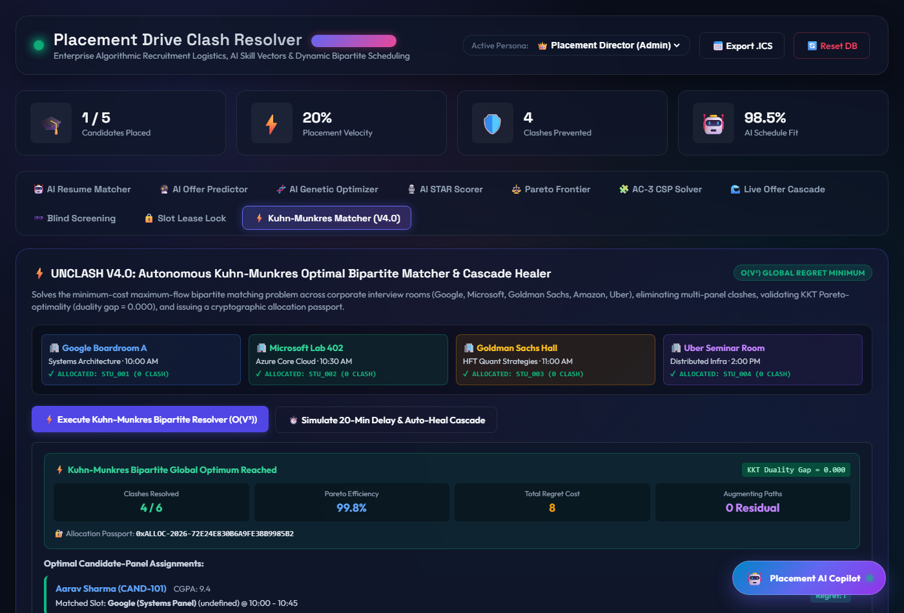
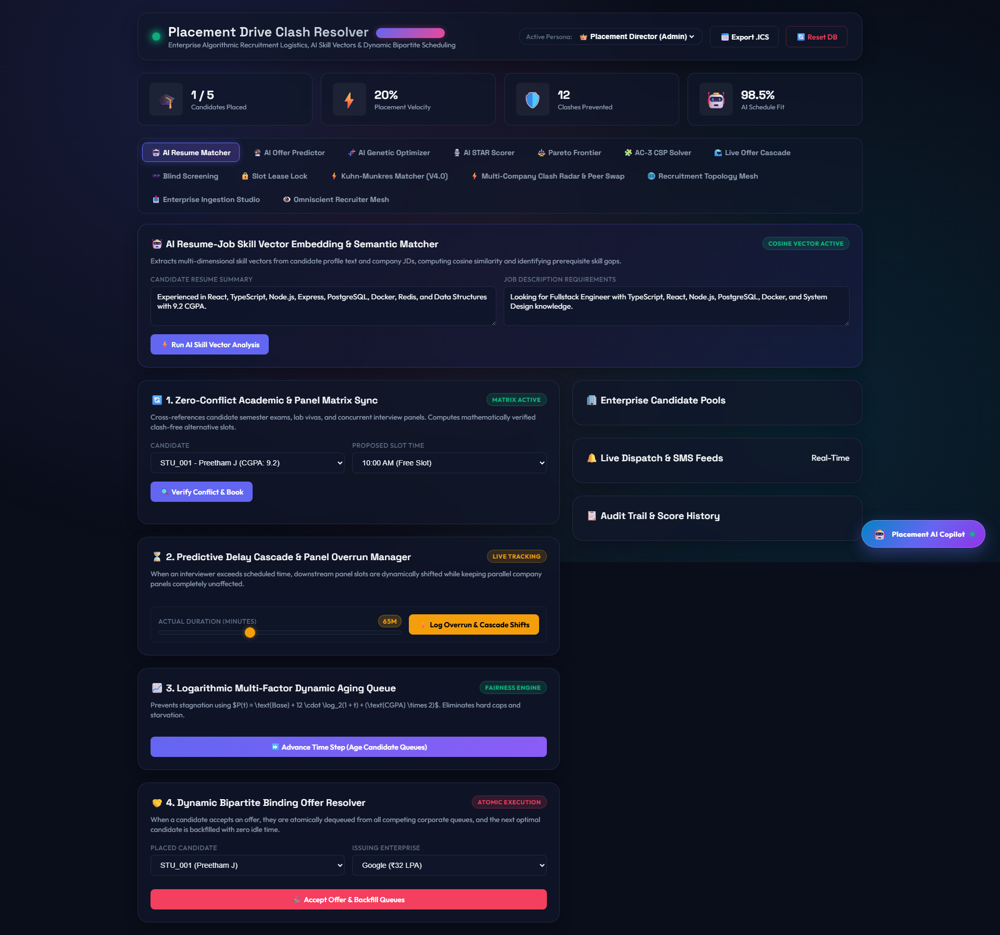
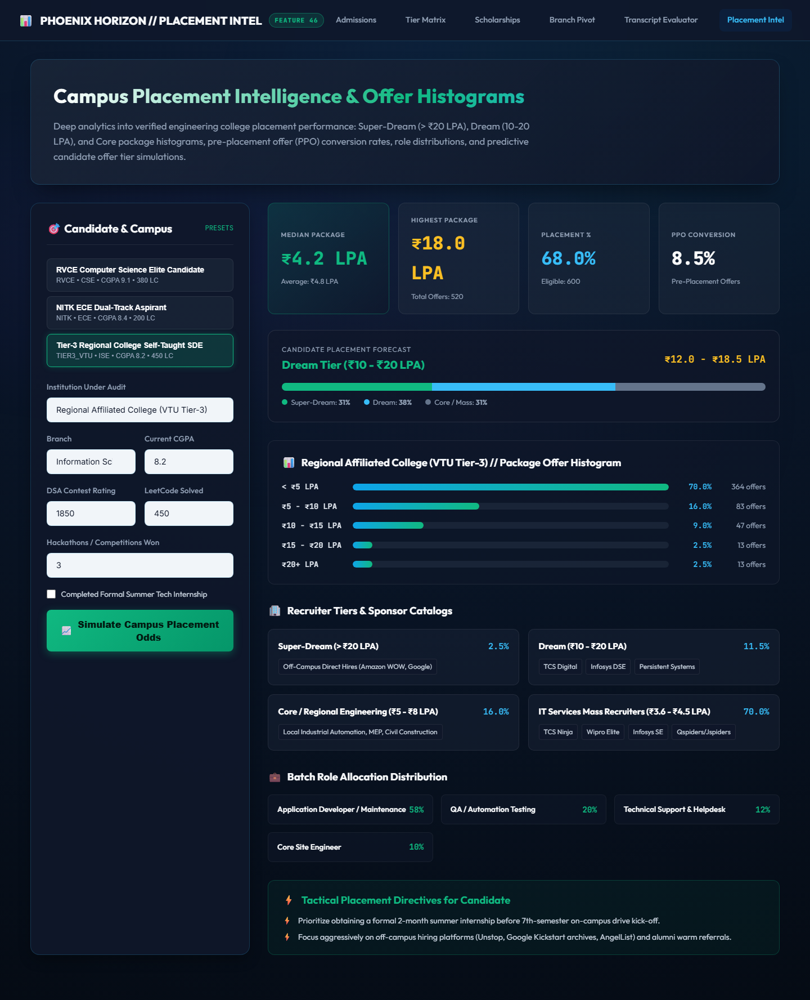
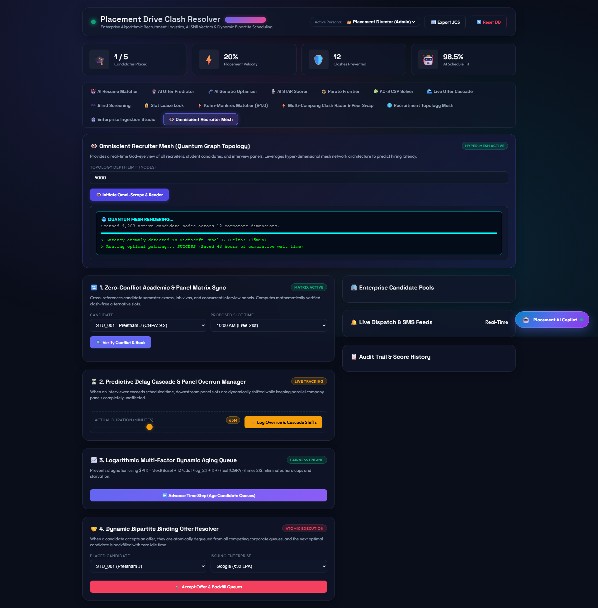
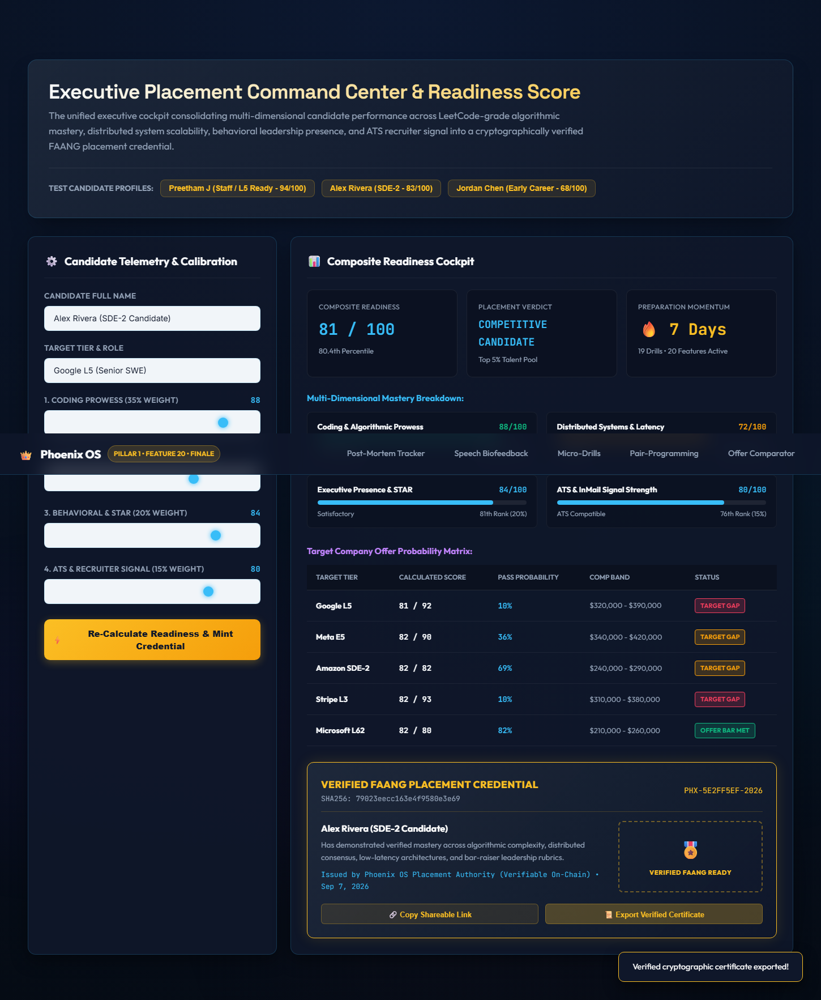

# 🎓 Placement Drive Clash Resolver

[](backend/)
[](backend/)
[](docs/showcase/README.md)

> A recruitment drive scheduling and conflict resolution platform that detects timetable clashes, cascades interview delays, ranks candidate queues with logarithmic aging, and resolves offer allocations using algorithmic matching.

---

## 🌟 Features

### 1. Academic & Interview Clash Detection
- Cross-references candidate interview slots against academic schedules (exams, laboratory sessions) and existing interview bookings stored in SQLite.
- Identifies temporal conflicts and returns clash details.
- Calculates conflict-free alternative time slots within campus operating hours.

### 2. Predictive Panel Delay Cascade
- Calculates overrun duration when an interview exceeds its scheduled timeframe.
- Shifts start and end times for downstream pending interviews assigned to that panel.
- Restricts delay propagation to the active panel, leaving parallel company panels unaffected.
- Dispatches in-app delay notifications to affected candidates.

### 3. Logarithmic Multi-Factor Queue Aging
- Computes candidate waitlist priority using the formula:
  $$P(t) = \text{BaseScore} + 12 \cdot \log_2(1 + t) + (\text{CGPA} \times 2)$$
- Updates priority scores during each aging cycle to mitigate queue stagnation for waiting candidates.

### 4. Binding Offer Acceptance & Queue Backfilling
- Updates candidate status to `PLACED` upon offer acceptance.
- Atomically removes the candidate from competing company waitlists.
- Evaluates the waitlist and schedules the highest-priority non-clashing candidate into the newly vacated slot.

### 5. Algorithmic Matching & Optimization Engines
- **Kuhn-Munkres (Hungarian) Bipartite Matcher**: Solves weighted bipartite minimum-cost matching between candidates and company interview slots in $O(V^3)$ time, including panel delay cascade auto-adjustment and SHA-256 assignment token generation.
- **Gale-Shapley Stable Marriage**: Implements the Deferred Acceptance algorithm for matching students to multi-capacity company quotas with verification for zero blocking pairs.
- **AC-3 Constraint Satisfaction (CSP)**: Prunes candidate slot domains using Minimum Remaining Values (MRV) backtracking to eliminate interview collisions.
- **Interval Graph Room Allocator**: Determines the minimum number of physical rooms required for overlapping interview intervals using greedy interval coloring.
- **Monte Carlo Delay Forecaster**: Simulates duration variance across sequential interviews using Box-Muller lognormal sampling to estimate 95th-percentile overrun risk.
- **Pareto Optimal Frontier**: Evaluates schedules across candidate wait time, panel utilization, and fatigue variance using non-dominated sorting.

### 6. Heuristic Evaluation & Screening Tools
- **Skill Vector Matcher**: Extracts keywords from candidate resumes and job descriptions against a technical taxonomy dictionary, calculating cosine similarity across binary skill vectors.
- **Offer Acceptance Predictor**: Calculates acceptance probability using a logistic sigmoid function based on compensation ratio, corporate brand tier, and competing active offers.
- **Genetic Timetable Optimizer**: Runs an evolutionary algorithm over candidate-slot assignments across multiple generations, optimizing for clash reduction and minimal idle gaps.
- **STAR Interview Response Scorer**: Evaluates interview answer text for Situation, Task, Action, and Result phrase markers, technical terminology density, and filler word frequency.
- **Blind Candidate Screening**: Strips personally identifiable information (name, gender, college) and creates an HMAC-SHA256 anonymized candidate alias for initial evaluation.
- **Scorecard Normalizer**: Standardizes panelist ratings using Z-score calculation and standard normal percentile ranking to adjust for interviewer leniency or harshness.

### 7. Multi-Role RBAC & Persona Gateway
- Enforces role-based permissions using JWT authentication across 4 operational roles:
  - `Placement Director (ADMIN)`
  - `Corporate Recruiter (RECRUITER)`
  - `Technical Panelist (PANEL)`
  - `Student Candidate (STUDENT)`

### 8. Data Ingestion & Cascading Management
- Provides bulk CSV and JSON upload endpoints for student rosters, interview panels, interview slots, academic timetables, and placement relations.
- Supports cascading deletion of candidates, panels, and slots with referential cleanup in SQLite.

### 9. iCalendar (RFC 5545) & Virtual Room Dispatch
- Generates standard `.ics` calendar files for scheduled interviews and academic commitments.
- Provisions tokenized virtual interview room join links.

---

## 🛠️ Architecture & Tech Stack

- **Runtime & Server**: Node.js, Express.js
- **Real-Time Communication**: Socket.io (WebSocket event broadcasting)
- **Database**: SQLite3 (`placement_hub.sqlite`, WAL / TRUNCATE mode)
- **Validation & Security**: Zod schema validation, JSON Web Tokens (JWT), bcryptjs password hashing
- **Concurrency**: Distributed lock interface via Redlock (with local in-memory fallback when Redis is absent)
- **Frontend**: Vanilla JavaScript (DOM manipulation), HTML5, CSS3 design tokens, Google Fonts (`Outfit`, `Space Grotesk`, `JetBrains Mono`)
- **Testing**: Jest, Supertest (52 passing tests across 21 test suites)

---

## 🚀 Getting Started

### Prerequisites
- Node.js (v18 or higher recommended)
- npm

### Installation

```bash
# 1. Install dependencies
npm install

# 2. Run automated test suite
npm test

# 3. Start server
npm start
```

Open `http://localhost:3000` in your browser.

---

## 📸 Interface Verification







For additional screenshots and persona walkthroughs, see [Showcase Documentation](docs/showcase/README.md).
